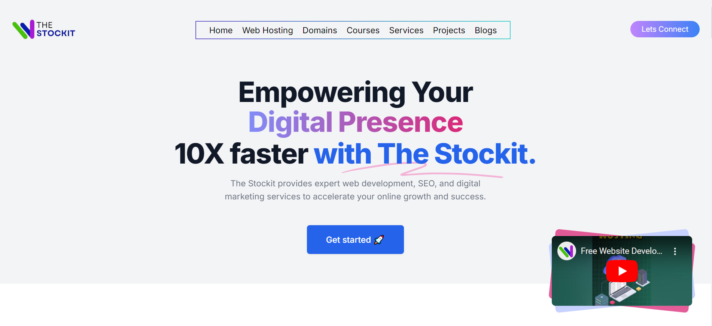
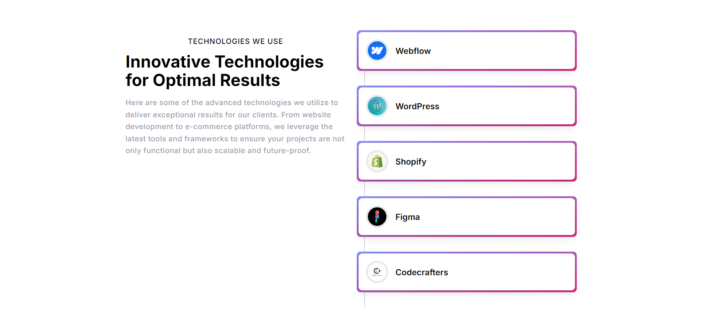
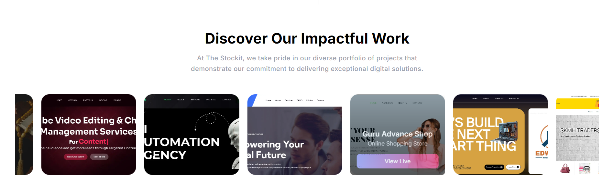

# The Stockit - Digital Marketing Agency

The Stockit is designed to provide potential clients with an engaging experience while showcasing our capabilities in digital marketing. With a modern and responsive design, this website effectively communicates brand message and services.

## Features

- 🎨 **Stunning Animations**: Each section is designed with eye-catching animations to enhance user experience.
- 🌐 **11 Interactive Sections**: Detailed information about our services, including:
  - **Web Development**
  - **SEO Services**
  - **Digital Marketing Strategies**
  - **Portfolio Showcase**
  - **Client Testimonials**
  - **Blog and Resources**
  - **Contact Us**
  - And more!
- 📱 **Responsive Design**: Optimized for all devices, ensuring a seamless experience on desktops, tablets, and mobile phones.









This is a [Next.js](https://nextjs.org/) project bootstrapped with [`create-next-app`](https://github.com/vercel/next.js/tree/canary/packages/create-next-app).

## Getting Started

To explore the project:

1. Clone the repository:
   ```bash
   git clone https://github.com/yourusername/the-stockit.git

First, run the development server:

```bash
npm run dev
# or
yarn dev
# or
pnpm dev
# or
bun dev
```

Open [http://localhost:3000](http://localhost:3000) with your browser to see the result.

You can start editing the page by modifying `app/page.js`. The page auto-updates as you edit the file.

This project uses [`next/font`](https://nextjs.org/docs/basic-features/font-optimization) to automatically optimize and load Inter, a custom Google Font.

## Learn More

To learn more about Next.js, take a look at the following resources:

- [Next.js Documentation](https://nextjs.org/docs) - learn about Next.js features and API.
- [Learn Next.js](https://nextjs.org/learn) - an interactive Next.js tutorial.

You can check out [the Next.js GitHub repository](https://github.com/vercel/next.js/) - your feedback and contributions are welcome!

## Deploy on Vercel

The easiest way to deploy your Next.js app is to use the [Vercel Platform](https://vercel.com/new?utm_medium=default-template&filter=next.js&utm_source=create-next-app&utm_campaign=create-next-app-readme) from the creators of Next.js.

Check out our [Next.js deployment documentation](https://nextjs.org/docs/deployment) for more details.
